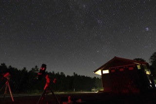

# はじめに
このページでは、私が大学生になってからどういうことをしてきたかを紹介します。

***
# 学部1年
- [ロケットサークル（CREATE）に入部](#ロケットサークル(CREATE)に入部)
- [小型人工衛星に搭載するスタートラッカを作成している企業でアルバイト](#小型人工衛星に搭載するスタートラッカを作成している企業でアルバイト)
***
## ロケットサークル(CREATE)に入部
[CREATE公式サイトはコチラ！](https://createrocket.wixsite.com/create-tokyotech)

### 2024年度PV動画（画像クリックでYoutube）

### 何をやっていたか
- サークルが自作しているロケットの飛翔シミュレータ（Spica）の運用をしていた。
- この年はコロナであんまり活動できなかった。
- サークルを引退するまでにロケットを2機打ち上げた。
    - そのうち1機はプロジェクトマネージャー（PM）をしていた。
    - 他団体でも例がないロケットのロール制御に挑戦して成功した。

***

## 小型人工衛星に搭載するスタートラッカを作成している企業でアルバイト
- ブラックすぎて3ヶ月でやめた。
- なんだかんだ楽しかったし、理学と工学の人の動き方の違い（とりあえず手を動かすことの大切さなど）を学んだ。
- 基本的な電子工作、アルミ加工やボール盤での加工ができたのも良かった。
### スタートラッカとは
- 星の位置関係から人工衛星の姿勢を推定するために用いるカメラ装置のこと。
### 何をやっていたか
- アルミを使ったNC旋盤加工（CADソフトでモデリングした）
- マイコン（Ardino）を使ったPWM制御
### バイトの作業の一環で長野で星を見れたのはすごい良かった。

- 標高2000mを超える麦草峠の星空は最高だった。

- アンドロメダ銀河です。

***

# 学部2年
- [ロケットサークルでロケットを初めて打ち上げる](#ロケットサークルでロケットを初めて打ち上げる)
- [熱力学の教科書の査読をする](#熱力学の教科書の査読をする)
- [ライフサイエンス統合データベースセンター（DBCLS）でアルバイトをする](#ライフサイエンス統合データベースセンターdbclsでアルバイトをする)

## ロケットサークルでロケットを初めて打ち上げる
- C-53Jというロケットを打ち上げる。団体初となる自作エンジンを搭載したロケットの打ち上げに成功した。

- 自分が撮ったこの写真は永遠に広報画像として使われている。

## 熱力学の教科書の査読をする
- 西森研出身の高橋さんが執筆された『熱力学・統計力学 熱をめぐる諸相』の熱力学パートの査読をした。謝辞に名前が載っている。

## ライフサイエンス統合データベースセンター（DBCLS）でアルバイトをする
- サークルの友達からの紹介で、面白そうなバイトを始めた。
- 生命科学系の大学院生が、研究に使えるツールの導入方法を動画で紹介する[Webサイト](https://togotv.dbcls.jp/)で、僕はプログラミングの環境構築をメインに動画を作成していた。
    - 2024年のノーベル賞を取った[AlphaFold2の使い方動画](https://youtu.be/A8UzgE6GjE0?si=qidx9gX5LcK8tomi)も作成した。

***
# 学部3年
- [PMを務めたロケットの打ち上げに成功する](#PMを務めたロケットの打ち上げに成功する)
- [TogoTVで作ったLaTeXの構築動画が少しバズる](#TogoTVで作ったLaTeXの構築動画が少しバズる)

## PMを務めたロケットの打ち上げに成功する
- C-59Jの打ち上げに成功した。
    - リアルタイムのロール制御をミッションに掲げており、無事に成功した。
    - 朝2時から伊豆大島の砂漠に入って作業していた。

## TogoTVで作ったLaTeXの構築動画が少しバズる
- [執筆現在で1.9万回再生されていて嬉しい](https://youtu.be/vKRxCpn2KbA?si=cWG3sAayQ0_knupg)
- 嬉しかったコメント一覧：
    - ありがとうございます。複数のブログにあたりましたが、どれもエラーが出て解決しませんでした。この動画の通りに実行したところうまく行きました。大変参考になりました！
    - 他のサイトを参考にしてもぜんぜんダメで、この動画の通りにしたら初めて成功しました...！！！ 本当にありがとうございます！！！！！！感謝しかない
    - 神だ
    - ふゎあぁ…あぁ…、できたァアｱｱｧｧ(´；ω；｀)ｧｧｱｱア!!! いろんなサイトを見ても、出来ない分からないだったのに、やっと、、できた(T^T)。

# 学部4年
- [QunaSysにおいて、量子コンピュータの社会実装に関する取り組みを行う](#Qunasysにおいて量子コンピュータの社会実装に関する取り組みを行う)
- [TogoTVでの成果をまとめた本の執筆をする](#Togotvでの成果をまとめた本の執筆をする)
- [東工大理学院物理学系の首席卒業をした](#東工大理学院物理学系の首席卒業をした)

## QunaSysにおいて、量子コンピュータの社会実装に関する取り組みを行う
- 量子技術を駆使して社会課題を解決する国のプログラムである[Q-LEAP](https://www.jst.go.jp/stpp/q-leap/)の活動として、[株式会社QunaSys](https://qunasys.com/)においてインターン活動をした。
    - NISQを用いた材料探索に関する研究活動
    - 中高生向けのアウトリーチ活動
    - 学会で掲載されるポスターの作成
    
    に取り組んだ。
- インターンの代表として、取り組みについての取材を受けた。阪大まで行ってすごい機材で撮られた。Youtubeにあがっている。

## TogoTVでの成果をまとめた本の執筆をする
- 『[生命科学研究のためのデジタルツール入門 第2版](https://www.medsi.co.jp/products/detail/3975)』の執筆を手伝った。好評発売中！

## 東工大理学院物理学系の首席卒業をした
- 優秀だったらしい
    - 銀の盾を貰ったが、家に飾る場所がないのでおばあちゃんに渡した

# 修士1年
- [NTTDATAで長期インターン](#nttdataで長期インターン)
- [LINEヤフーで長期インターン](#lineヤフーで長期インターン)
    - 取り組みが[LINEヤフー Tech Blog](https://techblog.lycorp.co.jp/ja/20241029a)に載った。
- [AWSで1Dayインターン](#awsで1dayインターン)

## NTTDATAで長期インターン
- 2週間の長期インターンに参加した。
- 技術革新統括本部において、[IOWN技術](https://www.rd.ntt/iown/)に関する基盤づくりの取り組みを行った。
    - 具体的にはKubernetesの標準機能では実現が難しいマルチテナント構成を、別のOSSを組み合わせて実現した。
- 超絶トラブルに見舞われながら無事にシステム構築までできたので良かった。
- IOWNは成功してほしいです。

## LINEヤフーで長期インターン
- データサイエンス領域のインターンを行った。
- Analytics Engineeringと呼ばれるテーマに挑戦した。
- 取り組みは[会社のブログ](https://techblog.lycorp.co.jp/ja/20241029a)に公開されている。
- 社食が美味しかった。

## AWSで1Dayインターン
- クラウドサポートエンジニアのポジションでインターンをした。
- AWSでもやっていけそうな技術力と調査力を自分が持っていたので安心した。